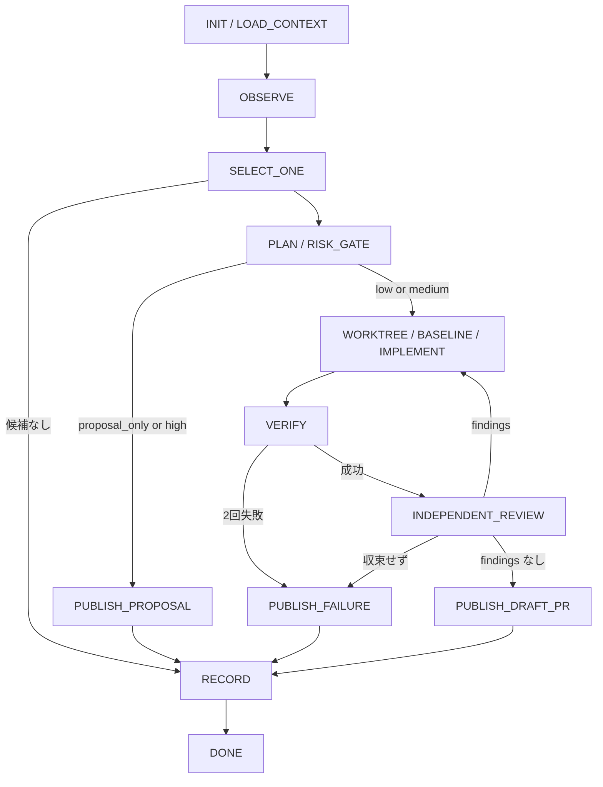

# 実装と公開

この文書は low / medium risk の実装を始める直前に最後まで読む。

## フロー



## worktree・実装・検証

- INIT で remote（既定名 `origin`）と default branch を解決し、以後同じ remote を使う。`git fetch <remote>` が不能なら観測時は warning、worktree 準備時は古い base へ fallback せず `blocked`。
- repository 操作前に外部 hook / CI wrapper 由来の `GIT_DIR` / `GIT_WORK_TREE` / `GIT_INDEX_FILE` が別 repo や index へ漏れないようにする。
- 通常 checkout には書き込まず、最新 `<remote>/<default>` から専用 worktree を作る。branch 衝突時は一意サフィックス、なお衝突すれば連番を付ける。他セッションの worktree・branch は変更しない。
- evidence を最新 base 上で再検証し、解消済みなら変更なしの正常系 `noop`。event 由来の untrusted ref を基点にしない。
- baseline で既存 failure と今回の failure を分離し、write_scope 外をついでに直さない。
- VERIFY は trigger 再現、test / lint / typecheck / build、full gate、diff 自レビューから必要十分な検証を選び、command・status・主要結果を記録する。再実装は 2 回まで。
- commit 前の staged diff と push 前の commit 群に secret 検査を行う 2 層契約とする。導入済み scanner を優先し、なければ pattern grep を使う。検出時は commit / push を中止し、値を転記しない。

## 独立レビュー

ファイル変更を伴うすべての実装はレビュー前に commit し、独立 backend へ objective・selected_task・write_scope・VERIFY と commit 済み diff を渡す。

```bash
codex -a never exec -C "<worktree>" -m gpt-5.6-sol -c model_reasoning_effort="medium" review --base <remote>/<default> < /dev/null
```

`review` は scope フラグと positional PROMPT を併用できない。objective 等を渡す要約付きレビューは `review` を使わず、`codex -a never exec -C "<worktree>" --sandbox read-only -m gpt-5.6-sol -c model_reasoning_effort="medium" "<レビュー指示>" < /dev/null` として専用 worktree 内で実行する。利用不能なら独立サブエージェントを使う。

findings がゼロで終了する。第 1 巡は最初の独立レビュー。件数は重複除去後の actionable findings 総数。件数が前巡以上の状態が 2 巡連続した / 同一 finding（同じファイル・箇所・根本原因。文言一致ではない）が 2 巡連続で再出した / 20 巡に達した場合は outcome を `failed` とする。独立レビュー手段がすべて不能で、レビュー必須 repo なら Draft PR を公開せず `proposal` へ降格する。レビュー必須でない repo だけ、未実施を明記した Draft PR を許可する。

## publish

- Draft PR はレビュー済み commit を push して作り、Trigger / Objective / 選定理由 / Changes / Verification / Risk / Non-goals / Review status と `<!-- repo-loop-run:<run_key> -->` を含める。
- proposal / failure は GitHub と認証が使えれば Issue、使えなければ最終報告へ出す。既存 Issue が trigger なら重複作成しない。
- security / secret / 脆弱性の high risk は private vulnerability reporting / security advisory を優先し、公開側へ詳細・再現手順・機微ログを書かない。

## outcome と RECORD

| outcome | 意味 |
|---|---|
| `noop` | 安全で価値ある改善がない、または解消済み。変更なしの正常系 |
| `draft_pr` | 実装・検証・レビュー後に Draft PR を作成 |
| `proposal` | high risk、検証不能、scope 超過、レビュー不能、proposal-only |
| `blocked` | 必須情報・権限・network・tool・base が不足 |
| `failed` | VERIFY の 2 回失敗、またはレビューが収束しない |

```json
{
  "schema": "repo-loop-result/v1",
  "outcome": "noop | draft_pr | proposal | blocked | failed",
  "run_key": "",
  "trigger_type": "manual | schedule | event",
  "base_sha": "",
  "objective": "",
  "selected_task": "",
  "risk": "low | medium | high | none",
  "attempts": 0,
  "changed_paths": [],
  "checks": [{"command": "", "status": "passed | failed | skipped", "summary": ""}],
  "artifact_url": "",
  "reason": "",
  "thought_db_update_proposal": ""
}
```

RECORD は人間向け要約と JSON を出し、secret・token・private ThoughtDB 本文・長大 log を含めない。

## 重複実行防止

repository identity / trigger / base SHA / normalized objective から安定した `run_key` を作る。`trigger.id` がなければ `trigger.name` / `trigger.url` / `trigger.summary` を含める。**実装前に** open / closed を含む全状態の PR / Issue から marker を検索し、同一 marker があれば worktree を作らず既存 URL を報告して `noop`。closed 済みでも同じ扱いとし、再実行には新しい objective を要求する。同一 run 内の二重 publish を禁止する。

## cleanup と非目的

この run が作成した一時 worktree だけ `git worktree remove` する。`--force` は使わない。Draft PR / failure に必要な branch は削除しない。未 push の clean branch だけ `git branch -d` で削除し、`-D` は使わない。拒否された対象は残して報告する。

V1 は cron・`/schedule`・GitHub Actions・Webhook receiver、常駐 process・中央 queue・横断 scheduler、LangGraph・Temporal 等の runtime、状態の永続化・途中再開、ThoughtDB 自動更新、複数課題一括実装を行わない。旧 `repo-maintainer` / `repo-maintainer-init` / `repo_maintainer.py` / `.devkit/repo-maintainer.toml` も復活させない。
